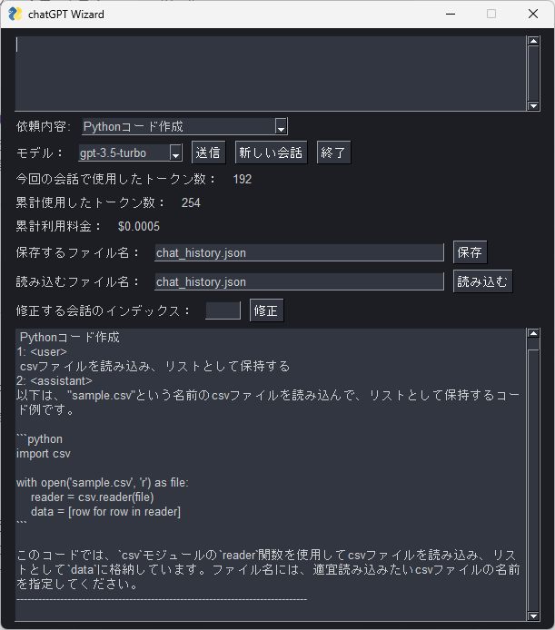

# ChatGPT Wizard

APIを使用し、PythonにてChatGPTを使うツールです
GUI化はPySimpleGUIを使用しています。

公式のライブラリを使用しています。
https://platform.openai.com/docs/libraries

## 使用手順
1. https://platform.openai.com/  よりAPIkeyを取得
2. 環境変数chatGPTを作成. APIkeyを値として入れる 
3. main.pyをcloneしてrequirementsのライブラリを入れる

### 補足 
API keyは下記のように、環境変数から行っています  
環境変数周りがよくわからなければ、APIkeyをそのまま入れても動きます

    openai.api_key = os.getenv("chatGPT")
## 使い方
### 依頼内容
どういった事柄を依頼したいのか選択できます。  
プロンプト文の省略が目的です。  
下記リストを変更して、カスタマイズが可能です。

    SYSTEM_CHOICES =["指定しない",
        "誤字脱字チェック",
        "VBAコード作成",
        "Pythonコード作成",
        "リファクタリング",
        "英語に翻訳"]
### 会話する
上の枠に会話内容を入力、送信を押してください
### 修正
 < user >の前に表示されている数字を入力し、修正を押してください  
修正を行うためのダイアログが表示されます
